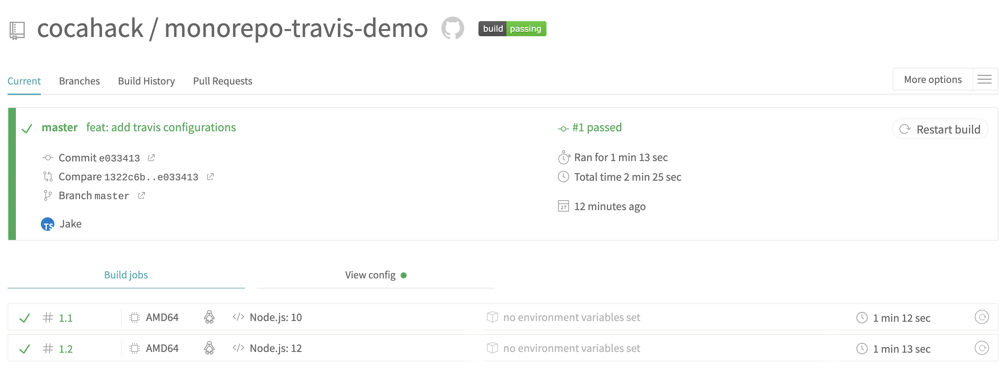
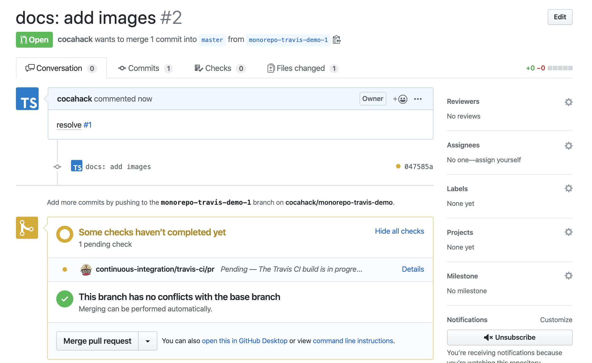

# monorepo-travis-demo

Testing CI/CD in monorepo that apply git branch strategy.

## Step 1: Configuring project

1. First, make yarn workspace

    ```bash
    user@~ $ mkdir monorepo-travis-demo && cd monorepo-travis-demo
   
    user@~/monorepo-travis-demo $ cat << EOF >> package.json 
    {
      "private": true,
      "name": "monorepo-travis-demo",
      "workspaces": [
        "packages/*"
      ],
      "scripts": {}
    }
    EOF
    ```

2. Create react app

    ```bash
    user@~/monorepo-travis-demo $ yarn create react-app packages/client --template typescript
    ```

    After installing react project, all dependencies locate `node_modules` directory of root.
 
3. Create nest.js app

    ```bash
    user@~/monorepo-travis-demo $ nest n --directory packages -p yarn server
    ```
  
****
Project structure

```
.
├── README.md
├── monorepo-travis-demo.iml
├── node_modules // All dependencies locate here
├── package.json
├── packages
│   ├── client
│   │   ├── README.md
│   │   ├── node_modules // Symbolic links locate here
│   │   ├── package.json
│   │   ├── public
│   │   ├── src
│   │   ├── tsconfig.json
│   │   └── yarn.lock
│   └── server
│       ├── README.md
│       ├── nest-cli.json
│       ├── node_modules // Symbolic links locate here
│       ├── package.json
│       ├── src
│       ├── test
│       ├── tsconfig.build.json
│       ├── tsconfig.json
│       └── tslint.json
└── yarn.lock
```

## Step 2: Connecting with Travis CI

1. Add commands for testing

    Add commands on root package.json

    ```json
    {
      "private": true,
      "name": "monorepo-travis-demo",
      "workspaces": [
        "packages/*"
      ],
      "scripts": {
        "test:client": "cd packages/client && yarn test --watchAll=false",
        "test:server": "cd packages/server && yarn test"
      }
    }
    ```

2. Make .travis.yml

    ```yaml
    language: node_js
    node_js:
      - 10
      - 12

    cache:
      directories:
        - node_modules


    script:
      - yarn test:client
      - yarn test:server

    ```
   
3. Enable CI in travis Dashboard
 
4. Push commit master branch
 
    

## Step 3. Working with Github Issue
 
1. Go to the Github repository and make an issue
 
2. Make a new branch based on Github issue in your local repository

    ```bash
    ~/monorepo-travis-demo $ git checkout -b monorepo-travis-demo-1
    ```

3. Turn off build option in Travis CI dashboard

    We need to make the code build only when a Pull request occurs.
 
    Go to the your Travis CI settings dashboard(maybe your url is https://travis-ci.org/your-github-id/monorepo-travis-demo/settings) and disable 'Build pushed branches' option.
    
    And, If 'Build pushed pull requests' option disabled, enable that.
    
4. Commit your codes

    ```bash
    ~/monorepo-travis-demo $ git commit
    ~/monorepo-travis-demo $ git push origin monorepo-travis-demo-1
    ```

5. Make Pull Request that merge `monorepo-travis-demo-1` branch to `master` branch

    Travis web hook automatically builds your codes based on commits included Pull Request.
    
    

6. If succeed a build task, you can merge.